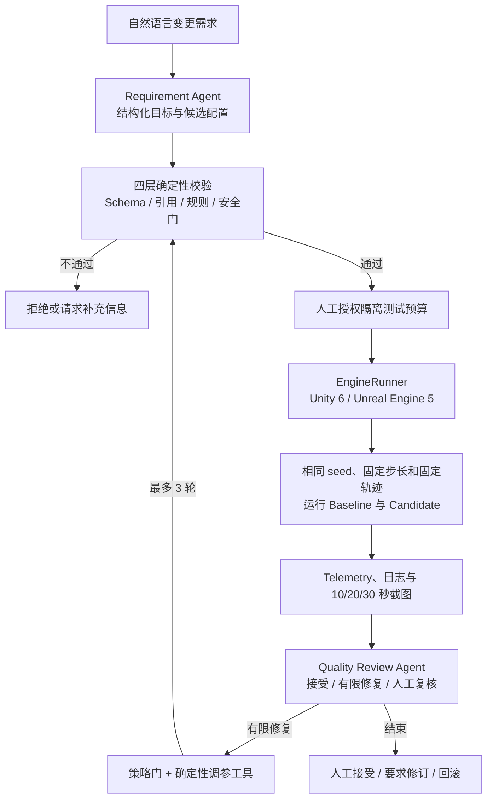
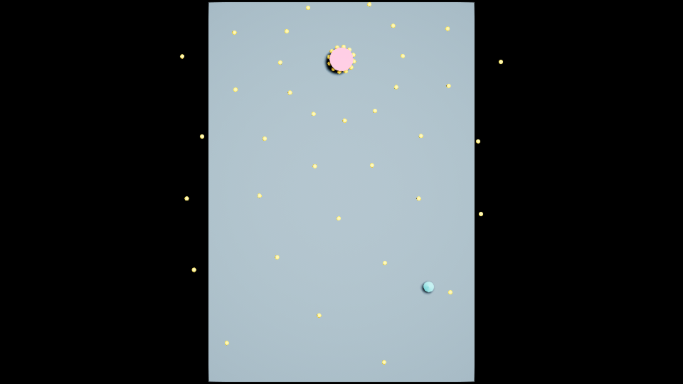
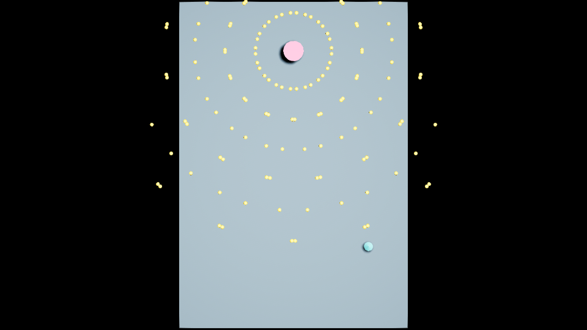
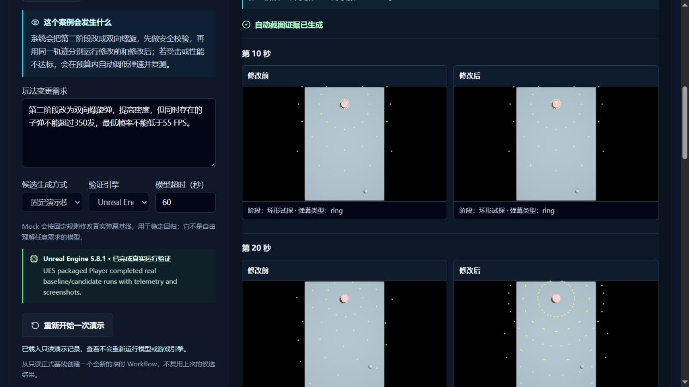

# Game Change Verification Agent

> 基于 AI Agent 的游戏配置变更生成、真实引擎执行与自动验证系统。

Game Change Verification Agent 用一个自建的 2.5D 弹幕 Boss 战作为可控 Runtime，把自然语言需求、候选配置、确定性校验、人工授权、Unity / Unreal Engine 执行、Telemetry 采集、结果评估和有限修复串成可回放的工程闭环。

项目重点不是制作游戏内容，而是验证一个更通用的问题：**LLM 生成的变更不能只看文本是否合理，还需要进入真实运行环境，用可复现证据判断它是否有效。**

## 为什么做这个项目

传统配置调整通常依赖人工往返：

```text
提出需求 -> 修改配置 -> 启动程序 -> 人工试玩 -> 观察结果 -> 再次修改
```

这类流程存在几个问题：

- LLM 输出结构合法，不代表运行后满足目标；
- 两次人工试玩的路线不同，难以公平比较修改前后；
- 性能、碰撞、阶段覆盖和异常日志容易依赖肉眼判断；
- 修改、测试和修复过程缺少统一快照，难以复现和审计；
- Agent 如果能直接改正式配置或任意代码，会扩大失败影响。

本项目将流程收敛为“生成 -> 校验 -> 授权 -> 执行 -> 采集 -> 评估 -> 有限修复”，让模型负责理解和决策，让确定性程序负责约束、计算和执行。

## 核心工作流



### Agent 与程序的分工

- **Requirement Agent**：把需求转换为结构化目标和候选弹幕配置。
- **Quality Review Agent**：结合原始需求、Config Diff、Telemetry 和修复历史选择下一步策略。
- **确定性校验器**：执行 Schema、引用、规则和权限检查，Agent 不能绕过。
- **确定性调参工具**：根据批准的有限动作计算具体数值，模型不直接覆盖正式配置。
- **EngineRunner**：以统一接口调用 Unity 或 UE5 Player，并规范化运行证据。

Mock 模式使用固定规则，免费且可重复，用于演示工作流和护栏；真实模式通过 OpenAI-compatible API 调用两个独立 Prompt，但仍受相同校验、预算和人工审批约束。

## 已实现能力

### 配置变更验证主线

- 支持 `ring`、`aimed_fan`、`spiral`、`petal` 四种配置化弹幕；
- 从自然语言生成候选 JSON，并输出字段级 Config Diff；
- 使用 Pydantic Schema、引用检查、规则引擎和安全门拦截非法或越权候选；
- 候选配置保存在独立 Workflow 目录，不覆盖已提交 Baseline；
- 一次人工授权最多允许 3 次候选引擎运行和 4 次模型调用；
- Baseline / Candidate 使用相同 Player、seed、固定步长、移动轨迹、时长和相机；
- 采集子弹总数、峰值存活子弹、玩家受击、生存时间、阶段覆盖、FPS 和异常日志；
- 在第 10、20、30 秒生成同条件截图，用于公平的 Before / After 画面对比；
- Agent 只能选择受限修复动作，数值由确定性工具计算并重新校验；
- 最终接受、修订和回滚均由人工决定，“接受”当前不会写回正式 Baseline。

### 跨引擎执行

- **Unity 6**：完整 2.5D 弹幕验证测试床、固定 60 Hz 模拟、对象池、Telemetry 和自动截图；
- **Unreal Engine 5**：C++ 读取同一 Bullet Hell 1.0 契约，支持固定种子、轨迹、Telemetry 和自动截图；
- **统一证据层**：不同引擎保留原始输出，同时映射为统一的验证指标；
- 跨引擎目标是验证工作流对不同执行端的适配能力，不要求 Unity 与 UE5 逐帧数值一致。

### 代码变更验证扩展

- 支持开发者提交人工 C# Diff，经静态规则、Quality Review 和人工审批后在隔离 Unity 副本中验证；
- 支持受控 Code Change Agent 从最多 3 个明确授权的 C# 文件生成候选 Diff；
- 补丁不能读取未授权文件、写入主仓库、执行任意进程或自动合并；
- 提供 12 个脚本化护栏样本和 5 个真实 Provider 小型代码需求评测；
- 当前不会自动判断“应该改配置还是代码”，也不会把生成代码直接写入正式分支。

## 技术架构

| 层级 | 技术与职责 |
|---|---|
| Agent / AI | OpenAI-compatible API、结构化输出、独立 Requirement / Quality Review Prompt、确定性 Mock |
| Backend | Python 3.10+、FastAPI、Pydantic、文件化 Workflow 状态与 Artifact |
| Validation | JSON Schema 语义、引用检查、规则引擎、安全门、策略门、Config / Patch Diff |
| Runtime | Unity 6000.3.19f1 + C#、Unreal Engine 5.8.1 + C++ / Blueprint、EngineRunner |
| Evidence | Telemetry、日志、配置哈希、阶段结果、固定时间截图、Comparison Report |
| Frontend | React 19、TypeScript、Vite 6；策划视图与开发者调试视图分级 |
| Engineering | pytest、PowerShell 自动化、固定种子、固定时间步、进程超时、路径白名单 |

后端保持单体 FastAPI 和本地文件持久化，没有引入数据库、Redis、消息队列、Docker 或微服务。这是当前单机验证 Demo 的明确取舍，不包装为生产级平台。

## 工程设计

### 隔离与权限边界

- 正式 Baseline、Candidate 和每轮修复版本分别保存；
- Runtime 只读取当前 Workflow 的受控快照；
- Web API 只能启动仓库注册的 Player，不能接收任意 EXE 或 PowerShell 命令；
- Agent 不能修改 C#、Scene、Prefab、项目设置或正式 Baseline；
- 代码补丁只应用到忽略目录中的隔离副本。

### 可复现与可回放

每个 Workflow 保存需求、结构化目标、配置快照、Diff、校验结果、Agent 决策、Telemetry、截图、修复历史和最终人工决策。固定 seed、固定步长和固定轨迹使同条件回归可重复；这些证据只表示固定测试画像，不代表所有玩家体验或统计学 A/B 实验。

### 失败处理

- 非法 JSON、未知 Pattern、缺失引用和数值越界在启动引擎前失败；
- Player 启动需要初始化日志握手，提前退出不会被误报为成功；
- 进程超时、缺失 Telemetry、配置哈希不一致、缺失截图和异常日志都有明确失败证据；
- 连续两轮无改善、预算耗尽或目标冲突时停止自动修复并请求人工处理。

### 可观察性与测试

- Agent 调用记录 Provider、模型、Prompt 类型、输入摘要、输出、延迟和失败阶段；
- Runtime 记录原始日志、Telemetry、阶段结果、配置哈希和截图清单；
- 当前 Python 全量基线为 **167 passed**；
- 12 个脚本化 Code Change 护栏样本的预期路由匹配率为 **100%**；
- Python Unit / API / Workflow 测试与真实 Unity、UE Player smoke 分开报告，Mock 结果不冒充真实引擎证据。

## 真实验证示例

主演示需求：

```text
第二阶段改为双向螺旋弹，提高密度，但同时存在的子弹不能超过 350 发，低分位 FPS 不能低于 55。
```

Unity 保存案例经过两轮有限修复后，峰值存活子弹从 `66` 增加到 `198`，固定轨迹受击从 `2` 降到 `0`，生存时间为 `36/36s`，低分位 FPS 约 `58.65`，异常日志为 `0`。

UE5 最新真实 smoke 使用同一契约、seed `20260727` 和 36 秒固定轨迹：峰值存活子弹 `70 -> 192`，固定轨迹受击 `1 -> 0`，低分位 FPS 约 `60`，Baseline / Candidate 运行错误均为 `0`。

| 修改前：单向螺旋 | 修改后：双向螺旋 |
|---|---|
|  |  |

> 截图由 UE5 自动运行在相同时间点生成，不是人工试玩截图。手动试玩仅用于主观体验，不作为严格比较证据。



> Web 截图展示已保存的只读演示 Workflow（Candidate 峰值为 `158`）；上方 `70 -> 192` 是 2026-08-10 重新执行的最新 UE smoke。两组证据均来自真实 UE Player，但属于不同运行记录，不混写为同一次结果。

## 项目结构

```text
game-change-verification-agent/
├── services/agent-python/   # Agent、Workflow、API、校验、评估与 pytest
├── web-console/             # React / TypeScript 控制台
├── game-unity/              # Unity 6 测试床源工程
├── game-unreal/             # UE5 C++ 验证切片源工程
├── configs/                 # 已提交 Baseline 与示例 Candidate
├── contracts/               # 稳定数据契约说明
├── scenarios/               # 固定测试画像
├── evals/                   # 版本化评测数据集
├── artifacts-samples/       # 可公开的小型历史证据样例
├── scripts/                 # 安装、启动、测试、Build 和 smoke 脚本
├── docs/                    # 架构、里程碑、边界和证据说明
└── runtime-artifacts/       # 本地运行产物，Git 忽略
```

## Quick Start

### 环境要求

基础 Agent 与 Web Console：

- Windows 10 / 11 与 PowerShell；
- Python `>= 3.10`；
- Node.js `>= 18` 与 npm；
- Git。

真实 Runtime 验证按需安装：

- Unity `6000.3.19f1`；
- Unreal Engine `5.8.1` 与对应 Windows C++ 工具链。

不安装游戏引擎时，仍可运行 Mock、静态校验、API、Web Console 和 Python 测试，但不能生成新的真实引擎证据。

### 首次安装

```powershell
git clone https://github.com/theHerta27/game-change-verification-agent.git
cd game-change-verification-agent
.\scripts\bootstrap.ps1
```

`bootstrap.ps1` 创建 `.venv` 并安装 Python / Web 依赖。依赖未变化时，日常启动不需要重复执行。

真实 Provider 为可选配置：

```powershell
Copy-Item .env.example .env
```

然后填写：

```text
GAMECONFIG_LLM_BASE_URL
GAMECONFIG_LLM_API_KEY
GAMECONFIG_LLM_MODEL
```

`.env` 已被 Git 忽略。未配置时请选择 Mock 模式。

需要重新构建真实引擎 Player 时，在当前 PowerShell 会话设置本机编辑器路径：

```powershell
$env:GAMECHANGE_UNITY_EDITOR = "<Unity.exe 的完整路径>"
$env:GAMECHANGE_UE_EDITOR = "<UnrealEditor.exe 的完整路径>"
```

启动后端或执行构建脚本前设置即可；仓库不内置任何开发者机器的绝对路径。

### 启动

终端 1：

```powershell
.\scripts\start-backend.ps1
```

终端 2：

```powershell
.\scripts\start-web.ps1
```

访问：

- Web Console：`http://127.0.0.1:5173`
- API Health：`http://127.0.0.1:8000/api/health`
- OpenAPI：`http://127.0.0.1:8000/docs`

推荐先选择“固定演示模型（免费、结果可重复）”，完成候选生成和静态校验；真实引擎运行前需要在页面明确授权本次隔离测试。

## 测试与 Runtime 验证

基础回归：

```powershell
.\scripts\test-python.ps1
.\scripts\test-web.ps1
.\scripts\verify-repo-clean.ps1
```

真实 Runtime：

```powershell
.\scripts\smoke-unity.ps1
.\scripts\smoke-bullet-hell.ps1
.\scripts\build-unreal.ps1
.\scripts\smoke-unreal.ps1
```

本机已具备对应引擎和许可证时，可运行完整检查：

```powershell
.\scripts\test-all.ps1
```

Runtime 输出写入 `runtime-artifacts/`，Unity / UE Build、缓存、第三方模型和 `.env` 都不会进入 Git。

## 当前边界

### 已实现

- 配置候选生成、四层静态校验、人工授权、Unity / UE5 运行、Telemetry 评估、有限修复和人工决策；
- 受控人工 C# Diff 验证与受限 Code Change Agent 候选生成；
- Mock / 真实 Provider 分离，原始证据与规范化证据并存；
- 无本地第三方角色模型时可使用占位角色运行。

### Future Work

- 根据需求自动判断应修改配置还是代码，并进入对应隔离验证链；
- 将候选 C# Patch 的编译、运行和有限修复统一到主 Workflow；
- 增加更多失败注入样本和跨引擎契约一致性评测；
- 在保留人工审批的前提下，增加明确的 Baseline 版本晋升与回退机制。

当前仓库未附加开源 License。公开可见不代表授予复制、修改或分发权限。

## 进一步阅读

- [弹幕变更验证闭环](docs/MILESTONE7_BULLET_HELL_CHANGE_VERIFICATION.md)
- [UE5 跨引擎验证](docs/MILESTONE8_UE5_CROSS_ENGINE_VERIFICATION.md)
- [受控 Code Change Agent](docs/MILESTONE4_CONTROLLED_CODE_CHANGE_AGENT.md)
- [简历叙事与证据矩阵](docs/RESUME_NARRATIVE_EVIDENCE_MATRIX.md)
- [项目快速上下文](docs/AI_PROJECT_CONTEXT.md)
