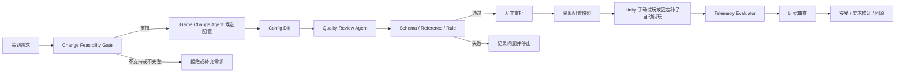

# Milestone 3A 配置变更闭环

## 这一阶段解决什么问题

以前的 GameConfig 演示可以“生成一份配置并校验”，也可以单独启动 Unity 试玩，但缺少游戏研发中最重要的控制环节：谁确认改动、改了什么、用哪份配置测试、测试后是否接受。

Milestone 3A 把这些步骤串成一个可回放的变更单：



它不是让 Agent 代替策划做最终决定，而是让 Agent 准备候选、检查风险、安排测试并整理证据，最后由人确认。

## 从哪个文件开始运行

后端唯一入口是：

```text
services/agent-python/api/server.py
```

启动 Uvicorn 后，这个文件创建三类能力：

1. 原有 `gameconfig_agent` API，负责配置生成、校验、经典案例和 Unity run。
2. 原有 `agent_service` API，负责代码 Diff 质量审查，留给 Milestone 3B。
3. 新增 `ChangeWorkflowService`，负责编排配置变更闭环。

策划前端入口是：

```text
web-console/src/main.tsx
web-console/src/ChangeWorkflowPanel.tsx
```

`main.tsx` 负责页面、经典案例和中英文切换；`ChangeWorkflowPanel.tsx` 只处理本次变更单的按钮、状态和证据展示。

## 一次标准新手试炼变更如何流动

以这段需求为例：

```text
将新手试炼武器基础攻击力改为 45，通关目标 60-90 秒，击败 5 个敌人，技能至少使用 1 次。
```

### 1. 创建变更提案

前端调用：

```http
POST /api/change-workflows
```

请求包含 `requirement_text`、`case_id`、`provider` 和 `timeout_seconds`。后端先在 `requirement_intake.py` 提取受支持约束：

```text
weapon_config.base_attack = 45
runtime_target_config.completion_time_seconds = [60, 90]
runtime_target_config.enemies_defeated = 5
runtime_target_config.skill_uses_min >= 1
```

### 2. Change Feasibility Gate

`workflow/config_change.py` 检查这些约束是否属于当前能力清单、是否互相冲突、是否超过安全范围。

例如“帮我画一个精美角色”会被拒绝，因为它属于美术资产生产；“把攻击力改成 999”也会被拒绝，因为当前新手试炼配置门禁只允许安全范围内的实验值。

门禁不是为了判断一句话“像不像游戏需求”，而是判断当前系统有没有明确的配置字段、Validator 和测试方法可以对它负责。

### 3. 生成候选和 Config Diff

Mock 模式读取已提交基线：

```text
game-unity/Assets/StreamingAssets/game_config.json
```

然后只把已识别的白名单约束映射到候选配置。它不是靠大模型自由猜测，因此每次结果都可重复。

真实 Provider 会先经过原有 generator、reviewer、repairer prompt 管线；只有最终 Schema、Reference 和 Rule 校验通过的结果才成为候选。之后同样应用明确约束并再次校验。

系统对基线和候选递归比较，产生 `config_diff.json`。前端把常用路径翻译成“新手武器基础攻击力”“目标最短通关时间”等策划术语，原始英文路径仍保留为技术证据。

### 4. 质量审查与人工审批

配置质量审查不复用代码 Review Agent。代码 Diff 和配置 Diff 的风险模型不同：前者检查资源泄漏、超时和安全问题，后者检查需求覆盖、数值参考、引用完整性和需要执行的游戏测试。

系统建议的测试至少包括：

- Schema、Reference、Rule 确定性校验。
- 战斗字段变化后的 Unity 固定种子试玩。
- 奖励或升级变化后的首通经济检查。

即使全部通过，候选仍处于 `proposed`，必须有人填写审批人并点击“批准进入 Unity 验证”。

### 5. 隔离 Unity 测试

批准后，`ChangeWorkflowService` 调用 `RuntimeRunService.prepare_snapshot()`。系统把候选复制到：

```text
runtime-artifacts/runtime_runs/<run_id>/final_configs.json
runtime-artifacts/runtime_runs/<run_id>/unity_contract.json
```

它不会修改已提交的 `game_config.json`。Unity Player 只读取本次 run 的 `unity_contract.json`，并把结果写回同一目录的 `telemetry.json`。

手动试玩用于观察手感；固定种子自动试玩用于可重复回归。两者回答的问题不同，不能用自动试玩代替真实玩家研究。

### 6. 运行评测与最终决策

页面轮询工作流状态。telemetry 出现后，现有 Runtime Evaluator 比较策划目标与实际结果，随后 Quality Review Agent 整理失败项和建议。

人可以做三种决定：

- **接受**：候选 hash 成为本次变更单的接受结果。当前原型只记录决定，不自动写回 Git 或生产配置。
- **要求修订**：保留证据，并回到新变更提案继续调整。
- **回滚**：活动指针回到基线 hash。因为测试始终隔离，所以不需要覆盖或恢复仓库文件。

## Mock 到底是不是写死的

是，但要区分两层：

1. 原有 `MockLLM` 固定产生 Training Sword 草稿，故意包含可修复问题，用于回归 Generator、Reviewer、Repairer 和 Validator。
2. Milestone 3A 的确定性约束映射器会把需求里的明确字段改到基线候选上，用于真实展示“需求改变了哪些配置”。

因此 Mock 能证明流程稳定、门禁有效、Diff 正确、Unity 测试可回放；它不能证明大模型能够理解任意策划语言。真实 Provider 专门评估后一个问题。

## 如何操作

当前阶段不需要安装 Blender。Blender 只用于重新转换灵梦模型，与配置变更闭环无关。

1. 运行 `scripts/start-backend.ps1`。
2. 运行 `scripts/start-web.ps1`。
3. 打开 `http://127.0.0.1:5173`，保持“策划 / QA 视图”。
4. 选择标准新手试炼案例，或编辑为上面的攻击力 45 示例。
5. 点击“创建变更提案”，检查配置变化、质量审查和建议验证。
6. 填写审批人，点击“批准进入 Unity 验证”。
7. 点击“准备隔离 Unity 测试”。
8. 选择“打开 Unity 手动试玩”或“运行固定种子自动试玩”。
9. 完成试玩后等待页面显示 Unity 运行证据。
10. 填写决策说明，选择接受、要求修订或回滚。

如果 8000 或 5173 已被其他项目占用，可使用 `start-backend.ps1 -Port 8001` 和 `start-web.ps1 -Port 5174 -BackendPort 8001`。`BackendPort` 会同步修改 Vite 的 `/api` 代理，不会再出现前端仍请求旧端口的问题。

## API

| 方法 | 路径 | 作用 |
|---|---|---|
| `POST` | `/api/change-workflows` | 创建提案并完成门禁、Diff、质量审查和静态校验 |
| `GET` | `/api/change-workflows/{workflow_id}` | 读取状态并同步 Unity telemetry |
| `POST` | `/api/change-workflows/{workflow_id}/approve` | 记录人工审批 |
| `POST` | `/api/change-workflows/{workflow_id}/runtime` | 准备隔离 Unity run |
| `POST` | `/api/change-workflows/{workflow_id}/launch` | 启动手动或自动 Unity 试玩 |
| `POST` | `/api/change-workflows/{workflow_id}/decision` | 接受、要求修订或回滚 |
| `GET` | `/api/change-workflows/{workflow_id}/artifacts/{name}` | 读取变更单证据文件 |

## 当前边界与下一步

- 接受候选只记录 hash 和人工决定，不自动提交 Git，也不修改生产表。
- 当前能力只覆盖 Starter Trial 配置字段，不处理角色美术、剧情、抽卡、商店或多人玩法。
- 当前文件状态机适合本地原型，不是多人并发审批系统。
- Milestone 3B 才会把人工 C# Diff 纳入 Quality Review、Unity 编译和测试闭环。
- Post-MVP 才考虑受控 Code Change Agent，并且必须在隔离工作目录和人工批准后执行。
