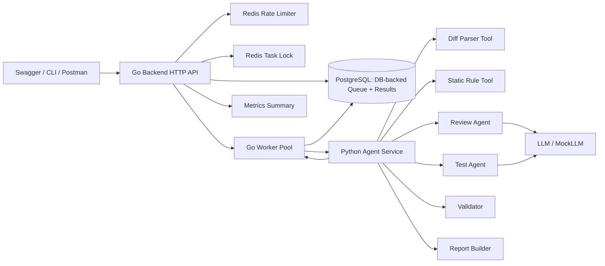

# DevQuality Agent 项目计划

## 1. 项目定位

`DevQuality Agent` 是一个面向 Git Diff 的代码审查与测试生成 Agent 平台。它接收开发者提交的 Git Diff，结合确定性静态规则和 LLM Agent 分析代码变更中的风险，输出结构化 findings、测试建议、Markdown 审查报告、执行轨迹、LLM 调用统计和人工反馈记录。

这个项目的核心目标不是展示“我会调用 LLM API”，而是展示一套可解释、可评测、可扩展、可回放的 Agent 工程系统：

- 可解释：每条 finding 有文件、行号、风险类别、证据、建议和置信度。
- 可评测：有人工标注的 evaluation dataset，能计算命中率、误报率、JSON 有效率、行号准确率等指标。
- 可扩展：Review Agent、Test Agent、静态规则工具、Validator、Report Builder 边界清晰。
- 可审计：保存任务状态、agent_runs、耗时、token、错误信息和用户反馈。
- 可回放：保存 diff 输入快照、diff_hash、运行模式、prompt/schema/static rule 版本、静态规则命中和 Agent 输出，使同一个任务能被离线复现。

第一版 MVP 只覆盖一个主 workflow：

```text
Git Diff
  -> 静态规则检查
  -> Review Agent
  -> Test Agent
  -> Validator
  -> Report Builder
  -> 人工反馈
  -> 评测脚本
```

明确不做：完整前端、GitHub App、自动 PR 评论、复杂 RAG、MCP、长期记忆、自动修复代码、多语言全覆盖、游戏引擎集成、Data Agent、美术资产生成、复杂多 Agent routing。

## 2. 岗位适配分析

| 岗位方向 | 项目体现的能力 | 需要重点讲清楚的点 |
|------|------|------|
| 游戏测试开发实习生 | 测试建议生成、badcase 分析、评测集、Mock LLM 压测 | 测试不是只生成代码，而是围绕风险点设计验证场景 |
| 游戏 AI 研发实习生 Agent 方向 | Agent workflow、工具调用、schema 校验、反馈闭环 | 为什么先 baseline，再拆 Review/Test 两个 Agent |
| 工程效率开发实习生 | Git Diff 审查、自动化报告、任务平台化 | 如何嵌入研发流程，如何减少重复人工审查成本 |
| AI 平台工程实习生 | Python Agent Service、LLM adapter、Mock LLM、评价指标 | Agent 服务如何工程化，而不是 notebook demo |
| 测试开发实习生 | evaluation dataset、测试建议、压测、质量指标 | 如何量化输出质量和系统稳定性 |
| Golang 后端实习生 | API、worker pool、Redis 限流、DB 持久化、context timeout | Go 负责平台化和资源治理，而不是写 Agent 逻辑 |
| AI Native/Data Agent 相关岗位 | 结构化输出、人工反馈闭环、可观测 agent_runs | Agent 输出如何被验证、存储、评测和改进 |

简历与面试中的叙述重点应是“可控并发 / 资源治理 / 异步任务调度”，不要包装成传统高并发秒杀系统。

## 3. 技术选型理由

| 层级 | 建议技术 | 理由 |
|------|------|------|
| Go Backend | Go + Gin/Chi + pgx/database/sql | 体现后端 API、任务调度、并发控制、context 和中间件能力 |
| Python Agent | CLI-first + Pydantic，后续 FastAPI + httpx 包装 | Phase 1 先稳定 Agent 行为，再服务化；Pydantic 适合严格 schema 校验 |
| 数据库 | PostgreSQL 优先，MySQL 可兼容 | 关系模型清晰；本地 Docker Compose 方便；也能迁移到 MySQL |
| Redis | 限流、任务锁、短期缓存 | 只承担短生命周期状态，不替代数据库 |
| LLM 适配 | OpenAI-compatible adapter + MockLLM | 避免绑定供应商；MockLLM 支持离线演示和压测 |
| 评测 | Python evaluation runner | 易于处理 JSONL、指标计算、badcase 报告 |
| 压测 | k6 | 适合 HTTP workflow 压测，能输出 P95/P99 |
| 部署 | Docker Compose | 一键启动 Go、Python、PostgreSQL、Redis |
| 文档 | README + OpenAPI/Swagger + 示例报告 | 面试可演示，评审者容易理解系统边界 |

## 4. 单 Agent vs 多 Agent 取舍

### 4.1 Phase 1 先做单 Agent baseline

单 Agent baseline 的职责是：输入 diff 和静态规则 hints，一次性输出 findings 与 test suggestions，并生成报告。

它的价值：

- 快速闭环核心链路，先证明场景可行。
- 提供可对照基线，后续才能判断双 Agent 是否真的改进。
- 降低早期复杂度，把主要风险集中在 diff 解析、schema、报告生成和评测上。
- 给双 Agent 拆分提供证据，而不是用“感觉更清晰”解释架构。面试中可以明确说明：先让一个模型同时完成代码审查和测试建议生成，实际观察它是否出现 findings 与测试建议不对应、JSON 结构不稳定、badcase 难以归因的问题，再据此拆出 Review Agent 和 Test Agent。

### 4.2 单 Agent 的问题

单 Agent 同时负责“发现风险”和“设计测试”，容易出现这些问题：

- 输出目标混杂：finding 与测试建议互相污染，结构不稳定。
- 上下文分配不清：模型可能在测试建议上花太多 token，反而遗漏风险。
- 难以评测：不知道 badcase 来自审查质量差，还是测试生成质量差。
- 难以重试：如果测试建议失败，不应该重复执行风险审查。

### 4.3 为什么拆成两个 Agent

Phase 2 拆成两个 Agent：

- Review Agent：只负责代码风险审查，输出结构化 findings。
- Test Agent：只根据已验证的 findings 生成测试建议。

拆分理由：

- 两个 Agent 有明确输入输出边界。
- Review Agent 的输出可以被 Validator 独立检查。
- Test Agent 可以在 finding 稳定后单独重试和评测。
- badcase 可归因：风险漏报属于 Review，测试不相关属于 Test。

### 4.4 为什么不拆成五六个 Agent

不拆更多 Agent 的原因：

- MVP 的核心不在多 Agent routing，而在稳定的审查-测试闭环。
- 太多 Agent 会增加调度、上下文传递、错误归因和成本控制难度。
- 很多模块是确定性工程模块，不应该伪装成 Agent。

不应叫 Agent 的模块：

| 模块 | 正确名称 | 原因 |
|------|------|------|
| diff_parser | Tool | 解析 diff 是确定性逻辑 |
| static_checker | Tool | 规则命中应可复现 |
| validator | Validator | 校验 JSON、枚举、行号、引用关系 |
| report_builder | Report Builder | 渲染 Markdown 报告 |
| evaluation_runner | Evaluator | 计算指标和输出 badcase |
| rate_limiter | Infrastructure | Redis 限流基础设施 |

## 5. Go vs Python 分工

### 5.1 Go Backend 职责

Go Backend 负责平台化和资源治理：

- HTTP API：任务创建、任务查询、报告查询、反馈提交、指标查询。
- 任务状态管理：pending/running/succeeded/failed/canceled。
- Redis 限流：用户级、全局 LLM 调用、同时运行任务数。
- worker pool：限制同时执行的审查任务数量。
- context timeout / cancel：防止 Agent 调用无限等待。
- 数据库存储：任务、findings、测试建议、反馈、agent_runs。
- 唯一数据库写入者：Go Backend 负责所有业务表写入，Python Agent 不直接连接数据库。
- DB-backed queue：`review_tasks` 中的 `pending` 任务就是 MVP 队列，Go worker 扫描或领取任务。
- 审计日志：记录请求、状态流转、错误原因。
- 调用 Python Agent Service：把 diff 分析任务交给 Agent 服务。

### 5.2 Python Agent Service 职责

Python Agent Service 负责 Agent 与 LLM 相关逻辑：

- Git Diff 解析。
- 静态规则工具。
- Prompt 管理。
- LLM / MockLLM 调用。
- Review Agent。
- Test Agent。
- Pydantic JSON schema 校验。
- Markdown 报告生成。
- evaluation dataset、runner、badcase 分析。
- 无状态计算：不直接读写数据库，不持有任务状态；只根据请求输入返回 `findings`、`test_suggestions`、`agent_runs`、`report_markdown`、`validation_errors`、可选 `parsed_diff_json` 和 `static_hints_json`。

### 5.3 分工理由

Python 适合 Agent 与 LLM 生态，Pydantic、CLI baseline、prompt 管理、JSON schema、评测脚本都更直接；等 Agent 行为稳定后再用 FastAPI 包装。Go 适合服务化、任务调度、并发治理、限流、超时、取消、事务写入、部署和稳定性控制。这样分层能体现“工程平台 + Agent 能力”两条主线，而不是为了展示技术栈强行混用。

## 6. 系统架构



核心运行流程：

1. 用户通过 Swagger/CLI/Postman 提交 Git Diff。
2. Go Backend 做参数校验、Redis 限流、任务锁检查，计算 `diff_hash`，把 diff 输入快照和任务元数据写入 `review_tasks`，状态为 `pending`。
3. `POST /api/review-tasks` 立即返回 `task_id`，不等待 Agent 执行完成。
4. Go worker pool 从数据库扫描或领取 `pending` 任务，并用事务或条件更新把任务改为 `running`，设置 context timeout。
5. Go worker 调用 Python Agent Service，把 diff、mode、prompt_version、schema_version、static_rule_version 等输入传入。
6. Python 解析 diff，运行静态规则，调用单 Agent 或 Review/Test Agent，并用 Validator 校验输出。
7. Python 返回 `findings`、`test_suggestions`、`agent_runs`、`report_markdown`、`validation_errors`、可选 `parsed_diff_json` 和 `static_hints_json`，不写数据库。
8. Go Backend 是唯一数据库写入者：在一个事务中写入 `review_findings`、`test_suggestions`、`agent_runs`，更新 `review_tasks.report_markdown`、`duration_ms`、`finished_at` 和最终状态。
9. 如果 Python 调用超时或校验失败，Go 在事务中把任务标记为 `failed`，记录 `error_message` 和必要的 agent_run。
10. 用户查询报告并提交人工反馈。
11. evaluation runner 汇总质量指标和 badcase。

## 7. 模块拆分

### 7.1 Go Backend 模块

| 模块 | 目录 | 职责 |
|------|------|------|
| server | `cmd/server` | 启动 HTTP 服务，加载配置 |
| api | `internal/api` | 路由、请求解析、响应封装 |
| service | `internal/service` | 任务业务逻辑、状态流转、调用 Agent |
| model | `internal/model` | 领域模型、DTO、枚举 |
| repository | `internal/repository` | 唯一数据库写入层；封装任务领取、结果事务写入和反馈写入 |
| queue | `internal/queue` | DB-backed queue；扫描/领取 `review_tasks.status=pending` 的任务，不引入 Redis Stream/Kafka/Celery |
| worker | `internal/worker` | worker pool、任务执行、超时控制 |
| ratelimit | `internal/ratelimit` | Redis 限流和并发额度 |
| config | `internal/config` | 环境变量和配置加载 |
| middleware | `internal/middleware` | request id、日志、recover、限流中间件 |
| client | `internal/client/agent` | Python Agent Service HTTP client |
| metrics | `internal/metrics` | 任务耗时、成功率、限流次数聚合 |

### 7.2 Python Agent Service 模块

| 模块 | 目录 | 职责 |
|------|------|------|
| cli | `agent_service/cli.py` | Phase 1 CLI baseline 入口，优先于 FastAPI |
| app | `agent_service/main.py` | Phase 1 行为稳定后再补 FastAPI 包装 |
| schemas | `agent_service/schemas.py` | Pydantic 输入输出模型 |
| prompts | `agent_service/prompts/` | Review/Test prompt 模板 |
| tools.diff_parser | `agent_service/tools/diff_parser.py` | 解析文件、hunk、行号 |
| tools.static_checker | `agent_service/tools/static_checker.py` | Go/Python 静态规则命中 |
| agents.review_agent | `agent_service/agents/review_agent.py` | 输出 findings |
| agents.test_agent | `agent_service/agents/test_agent.py` | 输出 test suggestions |
| llm | `agent_service/llm/` | LLM adapter 与 MockLLM |
| validator | `agent_service/validator.py` | JSON、字段、diff 相关性校验 |
| report_builder | `agent_service/report_builder.py` | Markdown 报告渲染 |
| evaluation | `agent_service/evaluation/` | 样本、runner、metrics、badcase |

Python 模块不得直接访问数据库，也不负责任务状态流转。它的返回值必须是可序列化的计算结果，由 Go Backend 决定如何持久化和如何更新任务状态。

## 8. 规划文件结构

后续实现建议采用以下结构。当前阶段只创建规划文档，不创建业务代码。

```text
devquality-agent/
  README.md
  docker-compose.yml
  .env.example
  docs/
    PROJECT_PLAN.md
    API.md
    ARCHITECTURE.md
    EVALUATION.md
    LOAD_TEST.md
    examples/
      sample_diff_go.patch
      sample_report.md
  backend/
    go.mod
    cmd/server/
      main.go
    internal/
      api/
      service/
      model/
      repository/
      queue/
      ratelimit/
      worker/
      config/
      middleware/
      client/agent/
      metrics/
    migrations/
  agent_service/
    pyproject.toml
    agent_service/
      cli.py
      main.py
      schemas.py
      prompts/
      tools/
        diff_parser.py
        static_checker.py
      agents/
        review_agent.py
        test_agent.py
      llm/
        base.py
        mock_llm.py
        openai_compatible.py
      validator.py
      report_builder.py
      evaluation/
        datasets/
        runner.py
        metrics.py
        badcase_report.py
    tests/
  loadtest/
    k6_review_tasks.js
  scripts/
    dev_up.sh
    run_eval.sh
    run_loadtest.sh
```

## 9. 数据库设计

### 9.1 `review_tasks`

| 字段 | 类型建议 | 说明 |
|------|------|------|
| id | uuid / bigserial | 任务 ID |
| repo_name | varchar | 仓库名 |
| branch | varchar nullable | 分支，可 mock |
| commit_sha | varchar | commit id |
| language | varchar | go / python |
| diff_hash | varchar | diff 文本 sha256，用于缓存、去重和回放 |
| diff_text | text | MVP 直接保存输入 diff 快照；样本较大时再拆 `review_task_inputs` |
| mode | varchar | single_agent/dual_agent/mock |
| prompt_version | varchar | Prompt 版本，用于回放和评测对比 |
| schema_version | varchar | 输出 schema 版本 |
| static_rule_version | varchar | 静态规则版本 |
| parsed_diff_json | jsonb nullable | 可选，diff_parser 输出快照 |
| static_hints_json | jsonb nullable | 可选，静态规则命中快照 |
| status | varchar | pending/running/succeeded/failed/canceled |
| created_by | varchar | 用户或 demo user |
| created_at | timestamp | 创建时间 |
| started_at | timestamp nullable | 开始时间 |
| finished_at | timestamp nullable | 结束时间 |
| duration_ms | integer nullable | 总耗时 |
| model_name | varchar nullable | 使用模型 |
| report_markdown | text nullable | Markdown 报告 |
| error_message | text nullable | 失败原因 |

索引：

- `idx_review_tasks_created_by_created_at`
- `idx_review_tasks_status_created_at`
- `idx_review_tasks_repo_commit`，用于查询和防重复。
- `idx_review_tasks_diff_hash`，用于缓存命中和回放。

MVP 将 `diff_text` 和 `diff_hash` 直接放在 `review_tasks` 中，避免过早拆表。若后续 diff 很大或需要保存多份输入快照，再新增 `review_task_inputs` 表，字段包括 `task_id`、`diff_text`、`parsed_diff_json`、`static_hints_json`、`created_at`。

### 9.2 `review_findings`

| 字段 | 类型建议 | 说明 |
|------|------|------|
| id | uuid / bigserial | finding ID |
| task_id | foreign key | 所属任务 |
| file_path | text | 文件路径 |
| line_number | integer | diff 中定位行 |
| severity | varchar | low/medium/high/critical |
| category | varchar | resource_leak/sql_injection/error_handling 等 |
| title | text | 简短标题 |
| evidence | text | 证据 |
| suggestion | text | 修复建议 |
| confidence | decimal | 0 到 1 |
| source | varchar | static_rule/review_agent/merged |
| is_confirmed | boolean nullable | 人工是否确认 |

索引：

- `idx_review_findings_task_id`
- `idx_review_findings_severity`
- `idx_review_findings_category`

### 9.3 `test_suggestions`

| 字段 | 类型建议 | 说明 |
|------|------|------|
| id | uuid / bigserial | 测试建议 ID |
| task_id | foreign key | 所属任务 |
| finding_id | foreign key nullable | 关联 finding |
| target_file | text | 建议测试文件 |
| test_name | text | 测试名 |
| description | text | 测试场景说明 |
| code | text nullable | 可选测试代码片段 |
| compile_status | varchar nullable | not_checked/pass/fail |

### 9.4 `review_feedback`

| 字段 | 类型建议 | 说明 |
|------|------|------|
| id | uuid / bigserial | 反馈 ID |
| finding_id | foreign key | 对哪个 finding 反馈 |
| user_action | varchar | false_positive/useful/accepted/ignored |
| comment | text nullable | 备注 |
| created_at | timestamp | 反馈时间 |

### 9.5 `agent_runs`

| 字段 | 类型建议 | 说明 |
|------|------|------|
| id | uuid / bigserial | 调用记录 ID |
| task_id | foreign key | 所属任务 |
| agent_name | varchar | single_agent/review_agent/test_agent/mock_llm |
| input_tokens | integer nullable | 输入 token |
| output_tokens | integer nullable | 输出 token |
| latency_ms | integer | 耗时 |
| status | varchar | succeeded/failed |
| error_message | text nullable | 错误 |
| created_at | timestamp | 创建时间 |

### 9.6 数据库写入 owner 与事务边界

Go Backend 是唯一数据库写入者。Python Agent Service 不直接连接数据库，不写 `review_tasks`、`review_findings`、`test_suggestions`、`review_feedback` 或 `agent_runs`。

成功任务的持久化事务：

1. 条件更新 `review_tasks`，确认当前任务仍是 `running`。
2. 写入或更新 `review_tasks.parsed_diff_json`、`static_hints_json`、`report_markdown`、`duration_ms`、`finished_at`。
3. 批量写入 `review_findings`。
4. 批量写入 `test_suggestions`，并映射到对应 finding。
5. 批量写入 `agent_runs`。
6. 更新 `review_tasks.status=succeeded`。

失败任务的持久化事务：

1. 写入失败的 `agent_runs`，如果已有。
2. 更新 `review_tasks.status=failed`、`finished_at`、`duration_ms`、`error_message`。
3. 释放 Redis 运行任务计数和任务锁。

这样做的原因是保证任务状态、结果、报告和 agent run 在数据库中一致，避免 Python 服务写入部分结果后 Go 侧状态失败造成不可回放。

### 9.7 DB-backed queue 设计

MVP 不引入 Redis Stream、Kafka、RabbitMQ、Celery 或外部任务队列。队列模型使用数据库表 `review_tasks`：

- `POST /api/review-tasks` 写入 `status=pending` 的任务并立即返回 `task_id`。
- Go worker pool 定期扫描或领取 `pending` 任务。
- 领取任务使用条件更新，例如 `WHERE id=? AND status='pending'`，成功更新为 `running` 的 worker 获得执行权。
- 任务状态流转固定为：`pending -> running -> succeeded / failed / canceled`。
- Redis 只负责限流、任务锁、短期缓存和运行任务计数，不承担队列语义。

领取策略：

- 简单实现：按 `created_at ASC` 扫描少量 pending 任务。
- 并发安全：使用事务和条件更新，或 PostgreSQL 的 `FOR UPDATE SKIP LOCKED`。
- 超时恢复：worker 启动时可扫描 `running` 且 `started_at` 超过超时阈值的任务，将其标记为 `failed` 或重新入队。

## 10. Redis 设计

Redis 只用于短期状态和资源治理，不作为主数据源，也不作为任务队列。

| 用途 | Key | TTL | 写入时机 | 释放/过期时机 |
|------|------|------|------|------|
| 用户级限流 | `dq:rl:user:{user_id}:{minute}` | 2 分钟 | 创建任务前 incr | TTL 自动过期 |
| 全局 LLM 限流 | `dq:rl:llm:global:{minute}` | 2 分钟 | worker 调用 Agent 前 incr | TTL 自动过期 |
| 同时运行任务数 | `dq:running:tasks` | 无固定 TTL | worker 开始任务时 incr | 任务完成/失败/cancel 时 decr |
| 任务锁 | `dq:lock:task:{repo}:{commit_sha}` | 10-30 分钟 | 创建任务前 set nx | 任务结束释放；异常靠 TTL |
| diff 结果缓存 | `dq:cache:diff:{sha256}` | 30-120 分钟 | 任务成功后写入 | TTL 自动过期 |

设计要点：

- 限流失败时直接返回明确错误，任务不入队。
- 任务锁只防止短时间重复提交，不替代数据库唯一约束。
- 运行任务数必须在 defer/finally 中释放，避免异常泄漏。
- diff 缓存只缓存最终结构化结果和报告，不缓存中间 prompt。

## 11. API 设计

### 11.1 Go Backend API

#### `POST /api/review-tasks`

创建审查任务。

请求字段：

| 字段 | 必填 | 说明 |
|------|------|------|
| repo_name | 是 | 仓库名 |
| branch | 否 | 分支 |
| commit_sha | 是 | commit id，可 mock |
| language | 是 | go/python |
| diff | 是 | Git Diff 文本 |
| created_by | 是 | demo 用户 |
| mode | 否 | single_agent/dual_agent/mock |
| prompt_version | 否 | 默认使用当前 prompt 版本 |
| schema_version | 否 | 默认使用当前 schema 版本 |
| static_rule_version | 否 | 默认使用当前静态规则版本 |

响应：

| 字段 | 说明 |
|------|------|
| task_id | 任务 ID |
| status | 固定先返回 pending，除非命中缓存可直接 succeeded |
| cache_hit | 是否命中 diff 缓存 |
| diff_hash | 输入 diff 的 sha256 |

#### `GET /api/review-tasks/{id}`

查询任务状态、耗时、错误信息和 finding/test suggestion 数量。

#### `GET /api/review-tasks/{id}/report`

返回 Markdown 报告和结构化结果。

#### `POST /api/findings/{id}/feedback`

提交人工反馈。

请求字段：

- `user_action`: false_positive/useful/accepted/ignored
- `comment`: 可选备注

#### `GET /api/metrics/summary`

返回任务数、成功率、平均耗时、P95、P99、限流次数、失败原因 TopN。

### 11.2 Python Agent Service API

#### `POST /agent/review`

正式 Agent workflow。

请求字段：

- `task_id`
- `repo_name`
- `commit_sha`
- `language`
- `diff`
- `mode`: single_agent/dual_agent
- `prompt_version`
- `schema_version`
- `static_rule_version`
- `model_config`

响应字段：

- `findings`
- `test_suggestions`
- `report_markdown`
- `agent_runs`
- `validation_errors`
- `parsed_diff_json`
- `static_hints_json`

约束：

- Python Agent Service 返回结果但不写数据库。
- Go Backend 接收响应后负责事务写入和状态更新。
- `agent_runs` 是 Python 对 LLM/MockLLM 调用的观测记录，由 Go 写入数据库。

#### `POST /agent/mock-review`

MockLLM workflow，用于离线演示和压测。

请求字段额外包含：

- `mock_latency_ms`: 1000/3000/5000
- `mock_case`: success/invalid_json/timeout/partial_findings

#### `POST /agent/evaluate`

运行小规模评测，返回指标和 badcase 摘要。

## 12. Agent Prompt 与 Schema 设计

### 12.1 Prompt 设计原则

Review Agent prompt 输入：

- Git Diff 的结构化片段：文件、hunk、新增行、上下文行。
- 静态规则命中 hints。
- 输出 schema。
- 严格要求只基于 diff 和 hints，不虚构文件、函数、行号。

Review Agent 输出目标：

- 找出真实风险。
- 给出证据和修复建议。
- 不生成测试建议。

Test Agent prompt 输入：

- 已验证 findings。
- Git Diff 摘要。
- 项目语言。
- 输出 schema。

Test Agent 输出目标：

- 为每条 finding 生成相关测试场景。
- 引用已有 finding，不重新审查代码。
- 不虚构不存在的文件和函数。

### 12.2 Review Agent Pydantic Schema

| 字段 | 类型 | 约束 |
|------|------|------|
| findings | list[Finding] | 可为空 |
| Finding.file_path | string | 必须出现在 diff 中 |
| Finding.line_number | int | 必须能映射到 diff 新增/上下文行 |
| Finding.severity | enum | low/medium/high/critical |
| Finding.category | enum/string | 建议枚举常见类别 |
| Finding.title | string | 简短，不超过 120 字符 |
| Finding.evidence | string | 必须引用 diff 中事实 |
| Finding.suggestion | string | 可执行修复建议 |
| Finding.confidence | float | 0.0-1.0 |

类别建议：

- `error_handling`
- `resource_leak`
- `timeout_missing`
- `sql_injection`
- `concurrency`
- `nil_pointer`
- `security`
- `test_gap`
- `logic_regression`

### 12.3 Test Agent Pydantic Schema

| 字段 | 类型 | 约束 |
|------|------|------|
| test_suggestions | list[TestSuggestion] | 可为空 |
| finding_index | int | 必须引用已有 finding |
| target_file | string | 测试目标文件或建议测试文件 |
| test_name | string | 语言风格合法 |
| description | string | 说明测试场景和断言 |
| code | string nullable | MVP 可选，允许只给伪代码或片段 |

### 12.4 Validator 检查项

Validator 是硬约束层，不调用 LLM：

- JSON 是否合法。
- schema 字段是否完整。
- `severity` 是否在枚举内。
- `confidence` 是否在 0 到 1。
- `file_path` 是否在 diff 中。
- `line_number` 是否可映射到 diff。
- finding 是否与 diff 或静态规则 hints 相关。
- test suggestion 是否引用已有 finding。
- 测试名是否出现明显幻觉的函数名或文件名。
- 空输出是否合理：没有风险时允许 findings 为空，但必须给出 summary。

## 13. 静态规则工具设计

静态规则工具只做确定性启发式检查，不追求完整编译级静态分析。它输出 hints 给 Review Agent，也可以直接生成 `source=static_rule` 的 finding。

### 13.1 Go 规则

| 规则 | 检测思路 | 输出 hint |
|------|------|------|
| 忽略 `err` | 新增行出现 `, err :=` 后未检查，或 `_ = err` | error_handling |
| `http.Get` 无 timeout | 新增 `http.Get` 或默认 client | timeout_missing |
| `resp.Body` 未 close | 有 `resp.Body` 读取但 hunk 内没有 `Close` | resource_leak |
| goroutine/channel 阻塞风险 | `go func` 内写无缓冲 channel，缺少 select/context | concurrency |
| SQL 字符串拼接 | `fmt.Sprintf`/`+` 拼接 SQL | sql_injection |
| context 没有传递 | HTTP/DB 调用使用 Background/TODO 或无 context | context_missing |
| nil pointer 风险 | 新增指针字段访问缺少 nil check | nil_pointer |
| defer 位置不合理 | 循环中 defer，或 err 前 defer body close | resource_leak |

### 13.2 Python 规则

| 规则 | 检测思路 | 输出 hint |
|------|------|------|
| `requests` 无 timeout | `requests.get/post` 无 timeout 参数 | timeout_missing |
| 裸 `except` | `except:` 或 `except Exception` 后无处理 | error_handling |
| SQL 字符串拼接 | f-string/%/+ 拼 SQL | sql_injection |
| `eval` / `exec` | 新增行包含 eval/exec | security |
| 文件未关闭 | `open()` 未使用 with | resource_leak |
| 异常被吞 | except 中只有 pass/log 后继续 | error_handling |
| 资源释放缺失 | lock/file/socket acquire 后无 finally/with | resource_leak |

### 13.3 输出给 Review Agent 的格式

每个 hint 包含：

- `rule_id`
- `language`
- `file_path`
- `line_number`
- `category`
- `message`
- `evidence_line`
- `confidence`

Review Agent 必须把 hints 当作证据之一，但不能无脑复制；最终 finding 仍需通过 Validator。

## 14. Evaluation 设计

### 14.1 数据集规模

MVP 建立 30-50 个 Git Diff 样本：

- Go：15-25 个。
- Python：15-25 个。
- 每个样本包含人工标注风险点。
- 样本覆盖正例、负例和边界 case。

### 14.2 数据来源与比例

数据集不只依赖手写样本，建议按三类来源构造：

| 来源 | 比例 | 用途 | 示例 |
|------|------|------|------|
| Synthetic Bug Diff | 约 50% | 手工构造典型错误，确保覆盖静态规则和 Agent 基础能力 | Go `http.Get` 无 timeout、Python `requests` 无 timeout、SQL 拼接、裸 except |
| Open-source Patch Diff | 约 30% | 从开源项目历史 bugfix commit 中抽取真实修复前后的 diff，提高样本真实性 | bugfix commit 中的资源释放、错误处理、边界条件修复 |
| Negative Diff | 约 20% | 无明显风险的正常改动，用于测试误报率 | 文案、日志格式、变量重命名、小型安全重构 |

构造策略：

- Synthetic Bug Diff 用于覆盖规则矩阵，保证每类核心风险至少 2-3 个样本。
- Open-source Patch Diff 只使用公开项目历史，不引入私有代码；标注时记录项目名、commit、抽取理由。
- Negative Diff 必须有人工确认“无明显审查风险”，否则不能用于误报率评估。
- 同一类风险要包含不同写法，避免模型只记住固定字符串模式。

### 14.3 文件结构

```text
agent_service/evaluation/
  datasets/
    go/
      001_http_no_timeout.patch
      001_expected.json
    python/
      001_requests_no_timeout.patch
      001_expected.json
    negative/
      001_safe_logging_change.patch
      001_expected.json
  runner.py
  metrics.py
  badcase_report.py
  reports/
    eval_summary_YYYYMMDD.md
    badcases_YYYYMMDD.jsonl
```

### 14.4 样本标注格式

每个 expected JSON 包含：

- `sample_id`
- `source`: synthetic/open_source/negative
- `language`
- `repo_url` 和 `commit_sha`，仅 open_source 样本需要
- `risk_points`
  - `category`
  - `file_path`
  - `line_number`
  - `severity`
  - `expected_test_scenario`
- `negative_reason`，仅 negative 样本需要
- `notes`

### 14.5 匹配规则

finding 命中不要求文本完全一致，而按结构化规则匹配：

- `file_path` 必须一致或可归一化为同一文件。
- `category` 必须一致，或属于预定义等价组，例如 `timeout_missing` 与 `resource_governance` 可映射。
- `line_number` 允许在同一 hunk 内或目标行上下 3 行范围内。
- `severity` 允许相差一级，但 critical 不能降为 low。
- `evidence` 必须引用 diff 中真实存在的事实。
- test suggestion 必须引用被命中的 finding，并覆盖 `expected_test_scenario` 的核心断言。

Negative Diff 的匹配：

- 期望 findings 为空，或仅允许 `severity=low` 且有明确证据的提示类 finding。
- 对无证据的高/中风险 finding 计入误报。

### 14.6 Badcase 分类

badcase report 至少按以下类型分类：

| 类型 | 含义 | 后续处理 |
|------|------|------|
| missed_finding | 标注风险未命中 | 补规则、改 prompt 或增加示例 |
| false_positive | Negative Diff 或无证据风险被报告 | 加强 evidence 校验和 negative 样本 |
| wrong_line | 风险类别正确但行号偏离 | 改 diff_parser 行号映射 |
| wrong_category | 找到问题但分类错 | 调整类别枚举和匹配规则 |
| invalid_json | 输出无法解析 | 加强 schema prompt、重试或 repair |
| unsupported_claim | 证据不在 diff 中 | Validator 拒绝并记录幻觉 |
| irrelevant_test | 测试建议未覆盖 finding | 拆分 Test Agent 或加强 finding 引用 |

### 14.7 指标

| 指标 | 含义 |
|------|------|
| JSON 有效率 | Agent 输出能被 schema 解析的比例 |
| finding 命中率 | 人工标注风险被命中的比例 |
| 误报率 | 输出 finding 中无对应标注且无法人工接受的比例 |
| 行号定位准确率 | line_number 在允许误差范围内的比例 |
| 测试建议相关性 | 测试建议是否覆盖对应 risk point |
| 平均耗时 | 单样本平均耗时 |
| 平均 token 成本 | 单样本平均 token |
| 人工反馈确认率 | 用户标记 useful/accepted 的比例 |

### 14.8 运行命令规划

后续实现后提供：

```text
python -m agent_service.evaluation.runner --dataset evaluation/datasets --mode mock
python -m agent_service.evaluation.runner --dataset evaluation/datasets --mode llm --limit 10
```

### 14.9 输出报告格式

报告包含：

- 总样本数、通过数、失败数。
- JSON 有效率、命中率、误报率、行号准确率。
- 按语言、风险类别分组的指标。
- Top badcases：漏报、误报、行号错、测试建议不相关。
- 改进建议：规则补充、prompt 调整、validator 加严。

## 15. 压测设计

### 15.1 原则

压测不调用真实 LLM API，使用 MockLLM 模拟 1s/3s/5s 延迟。目标是验证可控并发、排队、限流、超时、状态记录和数据库写入，不夸大 QPS。

### 15.2 工具

使用 k6：

- 能编排 10/30/50 并发任务。
- 能记录平均响应时间、P95、P99。
- 脚本易放入 `loadtest/k6_review_tasks.js`。

### 15.3 场景

| 场景 | 并发任务 | Mock 延迟 | 目标 |
|------|------|------|------|
| baseline | 10 | 1s | 验证基本吞吐和 DB 写入 |
| medium | 30 | 3s | 验证 worker pool 排队与限流 |
| pressure | 50 | 5s | 验证超时、失败原因和系统稳定性 |

### 15.4 记录指标

- 任务成功率。
- 平均响应时间。
- P95。
- P99。
- worker pool 排队时间。
- Redis 限流触发次数。
- 数据库写入是否正常。
- Go 服务是否超时。
- Python Agent Service 是否稳定。
- failed/canceled/timeout 的原因分布。

## 16. 开发阶段拆分与验收标准

### Phase 0：设计阶段

输出：

- PRD。
- 架构设计。
- 数据库设计。
- API 设计。
- Agent schema。
- evaluation 设计。

验收标准：

- 文档能解释项目定位和非目标。
- 能解释单 Agent baseline 与双 Agent 的取舍。
- 能解释 Go 与 Python 分工。
- 数据库、Redis、API、schema、评测、压测都有明确设计。
- 不包含业务代码。

### Phase 1：单 Agent baseline

实现：

- Pydantic schema。
- diff_parser。
- static_checker。
- MockLLM。
- single_agent workflow。
- Markdown report。
- 5 个 sample diff。
- CLI 命令跑通。
- 行为稳定后再补 FastAPI 包装。

验收标准：

- Phase 1 先不依赖 Go Backend、数据库、Redis 或 FastAPI。
- CLI 可以接收 diff 文件路径、language、mode、mock 配置并输出 JSON + Markdown。
- 至少 5 个 Go/Python 示例 diff 能运行。
- 输出 JSON 100% 通过 schema。
- 报告包含 findings、测试建议、耗时、模型信息。
- MockLLM 模式可离线运行。
- 能明确记录单 Agent 的 badcase。
- 能用 baseline 解释后续拆分依据：单 Agent 是否出现 findings 与测试建议不对应、JSON 结构不稳定、badcase 难以归因等问题。

### Phase 2：双 Agent workflow

实现：

- Review Agent。
- Test Agent。
- Validator。
- Report Builder。
- 单 Agent vs 双 Agent 对比。

验收标准：

- Review Agent 输出不包含测试建议。
- Test Agent 只引用已验证 findings。
- Validator 能拒绝无效 file_path、line_number、severity、finding_index。
- 对比报告说明双 Agent 是否改善 JSON 稳定性、测试相关性或 badcase 归因。

### Phase 3：Go 后端平台化

实现：

- HTTP API。
- 任务状态。
- 数据库存储。
- Redis 限流。
- worker pool。
- context timeout。
- 调用 Python Agent Service。

验收标准：

- `POST /api/review-tasks` 可以创建任务。
- `GET /api/review-tasks/{id}` 可以查询状态。
- `GET /api/review-tasks/{id}/report` 可以查看报告。
- `POST /api/findings/{id}/feedback` 可以记录反馈。
- 任务状态流转正确：pending -> running -> succeeded/failed/canceled。
- Redis 限流和任务锁能被测试覆盖。
- Agent 服务超时时 Go 能记录失败原因。

### Phase 4：评测与压测

实现：

- evaluation dataset。
- evaluation runner。
- badcase report。
- MockLLM 压测。
- README 文档。

验收标准：

- 至少 30 个样本可跑通。
- 输出评测 summary 和 badcase JSONL。
- k6 完成 10/30/50 并发场景。
- README 可一键启动项目并复现实验。
- 简历亮点只写已实现能力，不编造未验证数据。

## 17. 风险点和降级方案

| 风险 | 表现 | 降级方案 |
|------|------|------|
| LLM 输出不稳定 | JSON 解析失败、字段缺失 | Pydantic 校验 + retry once + MockLLM 演示 |
| 行号定位不准 | finding 指向不存在行 | diff_parser 建立行号映射，Validator 拒绝 |
| 误报较多 | finding 无事实依据 | 静态规则 hints + evidence 必填 + evaluation 反馈 |
| 双服务调试复杂 | Go/Python 接口联调成本高 | Phase 1 先 Python CLI baseline，行为稳定后再补 FastAPI，Phase 3 再接 Go |
| 压测成本高 | 真实 LLM 慢且贵 | 使用 MockLLM 模拟延迟 |
| Redis 锁泄漏 | 任务异常后无法重复提交 | 锁设置 TTL，任务结束显式释放 |
| worker 任务卡死 | Python Agent 超时无响应 | Go context timeout + Python request timeout |
| 数据库表过度设计 | MVP 实现变慢 | 保留 5 张核心表，扩展表后置 |
| README 夸大成果 | 简历数据无法复现 | 只写已实现功能和可复现实验结果 |

## 18. 后续扩展：game_dev_mode（非 MVP）

`game_dev_mode` 不进入 Phase 1，也不影响 MVP 的 Go/Python Git Diff 主线。它作为米哈游游戏 AI Agent / 游戏测试开发方向的后续扩展，用来展示对游戏研发质量场景的理解。

扩展范围：

- Unity C# 常见风险样本。
- 游戏策划配置 JSON/YAML 校验样本。
- 资源加载、NullReference、协程未停止、配置引用不存在等游戏研发场景。

候选规则：

| 场景 | 示例风险 | 可能输出 |
|------|------|------|
| Unity C# | `GetComponent<T>()` 后未判空 | NullReference 风险 finding |
| Unity C# | Coroutine 启动后缺少停止条件 | 生命周期和资源泄漏风险 |
| 资源加载 | Addressable/Resources 路径不存在或未释放 | 资源加载失败或内存风险 |
| 配置 JSON/YAML | 配置引用不存在的 item/skill/level id | 配置一致性 finding |
| 游戏逻辑 | 帧更新中执行重 IO 或同步加载 | 性能风险和测试建议 |

实现方式：

- 在 evaluation dataset 中增加 `game_dev_mode/` 样本目录。
- 扩展 `language` 或 `domain` 字段，例如 `language=csharp`、`domain=unity`。
- 复用 Review Agent/Test Agent/Validator 架构，不增加新的 Agent。
- 仅当 Go/Python 主链路稳定后再实现，避免 MVP 范围膨胀。

## 19. README 规划

最终 README 应包含：

1. 项目背景。
2. 为什么不是普通 LLM Demo。
3. 为什么先做单 Agent baseline，再拆 Review Agent + Test Agent。
4. 为什么 Go + Python 分层。
5. 系统架构图。
6. 任务流程图。
7. 数据库设计。
8. Redis 设计。
9. Agent 输出 Schema。
10. 评测方案。
11. 压测方案。
12. 快速启动。
13. 示例输入输出。
14. Badcase 分析。
15. 后续扩展，包括非 MVP 的 `game_dev_mode`。
16. 数据库写入 owner：Go Backend 是唯一数据库写入者，Python Agent Service 是无状态计算服务。
17. DB-backed queue 设计：`review_tasks.status=pending` 作为 MVP 队列。
18. 可回放设计：diff 快照、版本字段、静态规则命中和 agent_runs。

README 的演示顺序建议：

1. `docker compose up` 启动服务。
2. 用 Swagger 或 CLI 提交 sample diff。
3. 查询任务状态。
4. 查看 Markdown 报告。
5. 提交人工反馈。
6. 运行 evaluation。
7. 运行 MockLLM 压测。

## 20. 简历亮点草稿

以下内容应在功能真实实现后再写入简历；不要提前填写未验证指标。

- 设计并实现面向 Git Diff 的代码审查与测试生成 Agent 平台，支持 Go/Python diff 输入、结构化 findings、测试建议和 Markdown 报告生成。
- 使用 Go 构建任务平台层，实现审查任务创建、状态流转、worker pool、context timeout、Redis 限流与任务锁、PostgreSQL 持久化。
- 使用 Python 构建 Agent Service，拆分 Review Agent 与 Test Agent，并通过 Pydantic Validator 约束 JSON 输出、文件路径、行号和 finding 引用关系。
- 将静态规则工具与 LLM Agent 结合，针对 Go/Python 常见风险输出 deterministic hints，降低纯 LLM 审查幻觉。
- 建立人工反馈闭环，记录 finding 的误报、有用、采纳等反馈，为后续 badcase 分析和 prompt 优化提供数据。
- 构建小规模 evaluation dataset，评估 JSON 有效率、finding 命中率、误报率、行号定位准确率和测试建议相关性。
- 使用 MockLLM 和 k6 设计压测场景，验证多任务提交下的可控并发、排队、限流、超时和失败原因记录。

可量化指标必须在 Phase 4 完成后根据实际结果补充，例如：

- evaluation 样本数。
- JSON 有效率。
- finding 命中率。
- P95/P99 延迟。
- MockLLM 压测并发场景结果。

## 21. 下一步执行建议

建议下一轮从 Phase 1 开始，先实现纯 Python CLI 单 Agent baseline：

1. 定义 Pydantic schema。
2. 实现 diff_parser 的最小版本。
3. 实现 Go/Python 静态规则 hints。
4. 实现 MockLLM。
5. 实现 single_agent workflow。
6. 生成 Markdown report。
7. 准备 5 个 sample diff。
8. 提供 CLI 命令跑通端到端。
9. 行为稳定后再补 FastAPI 包装。

只有当 Phase 1 能稳定产出结构化结果后，再拆分 Review Agent/Test Agent。这样后续每一步都有可对照基线，面试时也能讲清楚设计演进。
