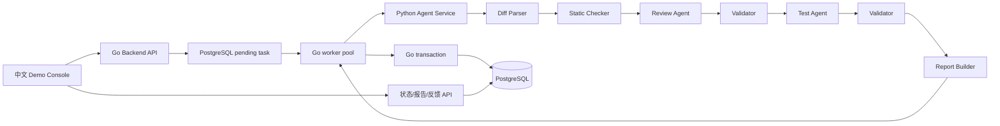

# DevQuality 项目理解手册

这份文档写给项目作者本人。目标不是包装项目，而是让你能准确回答：系统为什么存在、每一层做什么、哪些已经实现、哪些还没有。

## 先记住四句话

1. **DevQuality 是一个面向 Git Diff 的代码审查与测试建议 Agent 平台。**
2. **它的重点不是“调用一次大模型”，而是把模型放进可解析、可校验、可追踪、可反馈的工程流程。**
3. **Go 负责平台和任务生命周期，Python 负责 Diff 分析、Agent workflow 和 LLM。**
4. **当前真实模型只完成了少量 smoke test；Phase 4A 的高指标来自 MockLLM 和确定性规则，不能当作真实模型准确率。**

## 一句话定位

DevQuality 接收 Go/Python Git Diff，通过静态规则和单/双 Agent 工作流生成结构化风险项、测试建议与 Markdown 报告，并由 Go 后端负责排队、超时、持久化、反馈和可观测性。

## 它解决什么问题

直接让 LLM 做代码审查会遇到四类问题：

- 输出格式不稳定，程序无法可靠消费。
- finding 可能引用 diff 中不存在的文件或行号。
- 风险项和测试建议可能互相对不上。
- 出错后不知道是模型、Prompt、校验器还是平台链路的问题。

DevQuality 的处理思路不是假设模型永远正确，而是增加工程约束：

- `diff_parser` 建立文件、hunk 和新行号映射。
- `static_checker` 提供可复现的 deterministic hints。
- Pydantic schema 约束结构。
- Validator 检查路径、行号、枚举、置信度、证据和 finding 引用。
- Agent run 记录 provider、model、token、耗时、阶段和错误。
- Go Backend 管理异步任务、超时、限流、数据库事务和反馈。

## 输入是什么

核心输入是一次代码变更，而不是整个仓库：

- Git Diff 文本。
- 语言：`go` 或 `python`。
- 工作流：`single_agent` 或 `dual_agent`。
- 模型模式：`mock` 或 `real`。
- 可选请求级 LLM 配置；不传时可使用 Python Agent Service 的服务端默认配置。
- repo、branch、commit、创建人以及 prompt/schema/static rule 版本等回放信息。

当前系统只根据 diff 和 diff 上下文判断，不具备完整仓库检索、调用图分析或编译器语义。

## 输出是什么

一次成功任务主要输出：

- `findings`：文件、行号、严重度、类别、标题、证据、修复建议、置信度、来源。
- `test_suggestions`：关联的 `finding_index`、目标文件、测试名、步骤和可选代码。
- `agent_runs`：Review/Test 阶段的 provider、model、token、耗时和状态。
- `report_markdown`：用于阅读和演示的中文报告。
- `parsed_diff_json`、`static_hints_json`：用于回放和诊断的中间结果。
- validation errors / sanitized debug info：失败阶段、字段、期望和原因。

## 完整链路

按时间顺序理解：

1. 前端调用 `POST /api/review-tasks`。
2. Go 校验请求，经过 Redis 用户限流和 repo/commit 任务锁。
3. Go 计算 `diff_hash`，在 PostgreSQL 创建 `pending` 任务并立即返回 `202 + task_id`。
4. worker 使用 `FOR UPDATE SKIP LOCKED` 领取任务，状态变为 `running`。
5. worker 带 timeout 调用 Python `/agent/review`。
6. Python 解析 diff、运行静态规则，再执行 single 或 dual workflow。
7. Python 返回结构化结果，不写数据库。
8. Go 在事务中写入 findings、test suggestions、agent runs、报告和任务终态。
9. 前端轮询任务，展示结果、校验详情和报告。
10. 用户可以对 finding 提交 useful / not useful 和 comment，Go 写入 PostgreSQL。

任务状态是：`pending -> running -> succeeded / failed / canceled`。当前主要完成了 succeeded/failed 主链路，取消接口和有限任务重试不是完整产品能力。

## Go Backend 做什么

Go 是平台层，也是唯一数据库写入者：

- 提供任务、报告、反馈和指标 API。
- 参数校验、限流、任务去重锁。
- DB-backed queue 和 worker pool。
- 为任务设置 context timeout。
- 调用 Python Agent Service。
- 在事务中写任务结果。
- 保存 validation debug info。
- 请求级 API key 只暂存在进程内存，不落库。

为什么不是 Python 全包：项目需要明确展示任务治理、并发、超时和持久化边界，Go 在这部分更合适；Python 保留在 Agent/LLM 生态部分。

## Python Agent Service 做什么

Python 是无状态计算服务：

- 解析 unified diff。
- 运行 Go/Python 静态规则。
- 根据 mode 创建 MockLLM 或 OpenAI-compatible client。
- 执行 single/dual Agent workflow。
- 使用 Pydantic 解析模型结构。
- 使用 Validator 做业务约束校验。
- 必要时执行一次 schema repair 或 finding location repair。
- 生成 Markdown 报告和脱敏错误摘要。

Python 不连接 PostgreSQL，也不负责任务状态；这保证数据库写入 owner 唯一。

## PostgreSQL 做什么

PostgreSQL 同时承担事实数据存储和 MVP 队列：

- `review_tasks`：输入快照、版本、状态、耗时、报告、错误和调试信息。
- `review_findings`：结构化风险项。
- `test_suggestions`：测试建议及 finding 关联。
- `agent_runs`：各 Agent 阶段运行记录。
- `review_feedback`：人工反馈。

worker 通过任务状态和 `FOR UPDATE SKIP LOCKED` 并发领取 pending 任务。MVP 没有引入 Kafka、Celery 或 Redis Stream。

## Redis 做什么

当前 Redis 的真实职责是：

- 用户提交频率限制。
- repo/commit 任务锁和 TTL。
- 全局运行任务计数。

**当前没有实现结果缓存或语义缓存。** API 中虽然有 `cache_hit` 字段，但创建任务时固定返回 false。面试中不要说“已经用 Redis 缓存审查结果”。

## 前端 Demo Console 做什么

前端是演示和 Agent UX 层：

- 粘贴或从示例库载入 Git Diff。
- 选择 Go/Python、single/dual、Mock/Real。
- Real 模式可使用服务端默认配置或请求级临时覆盖。
- 展示 pending/running 状态，避免把未完成任务误判为零 finding。
- 展示 finding、测试建议、Markdown、raw JSON 和 validation debug。
- 提交 finding feedback。
- 展示 Phase 4A 指标边界和 smoke expected/actual 对照。

浏览器不会直接调用模型厂商，统一通过 Go Backend。

## MockLLM 和 Real LLM 的区别

| 维度 | MockLLM | Real LLM |
|---|---|---|
| 输出来源 | static hints 的确定性映射 | OpenAI-compatible Chat Completions |
| 可重复性 | 高 | 有非确定性 |
| 成本 | 无外部 API 成本 | 有 token 和网络成本 |
| 主要用途 | 单测、evaluation、故障注入、负载测试 | 少量真实 smoke 和演示 |
| JSON 失败 | 可模拟 invalid_json/timeout | schema repair 一次 |
| 能否代表真实模型质量 | 不能 | 少量 smoke 也不能代表大规模准确率 |

Phase 4A 的 31 个样本指标用于证明 workflow、schema、Validator 和确定性规则可复现，不是模型泛化能力。

## single_agent 和 dual_agent 的区别

`single_agent`：一次模型调用同时输出 findings 和 test suggestions，再统一校验。

`dual_agent`：

1. Review Agent 只生成 findings。
2. Validator 先校验 findings。
3. Test Agent 只接收已经验证的 findings。
4. Validator 再检查测试建议引用。

当前 mock dataset 中两者 finding/test 结果一致，dual 的 token estimate 更高。拆分价值不是“已证明准确率更高”，而是职责清楚、阶段可校验、错误可归因，未来可以独立重试。

## 你应该如何理解静态规则和 LLM 的关系

static checker 不是最终裁判，而是工具提示：

- MockLLM 严格根据 hints 生成结果，保证测试可复现。
- Real LLM prompt 明确写着 hints 只是线索，不要求照抄。
- Validator 只检查输出是否有结构和事实依据，不判断所有业务语义是否正确。

因此当前系统既不是纯规则扫描器，也不是完全放任的 LLM。

## 当前项目边界和限制

- 只支持 Go/Python diff，不支持完整仓库语义。
- 长 diff 还没有 chunking、检索或 token budget。
- static rules 规模有限，可能误报和漏报。
- 真实模型只做了 DeepSeek 小规模 smoke：Go positive、Go safe negative、Python positive。
- 没有真实模型盲测数据集，不能宣称真实准确率。
- feedback 已采集，但没有自动回灌 prompt、训练或在线策略。
- 没有结果缓存，`cache_hit=false`。
- 请求级 key 不落库，所以 Go 重启后尚未执行的临时配置任务不可恢复。
- 没有登录、权限、GitHub App、PR 自动拦截、Docker 强依赖或 multi-agent board。

## 最后形成的心智模型

把 DevQuality 看成三层：

1. **Agent 质量层**：parser、static hints、Prompt、schema、Validator、repair。
2. **平台可靠性层**：任务状态、DB queue、worker、timeout、Redis、事务和运行记录。
3. **人机协作层**：Demo Console、报告、错误解释、示例 expected/actual 和人工 feedback。

面试时围绕这三层讲，比罗列技术栈更容易说明项目价值。
