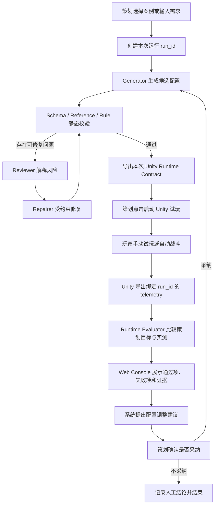

# GameConfig Agent 完整工作流理解指南

## 1. 先给出结论

这个项目真正要解决的问题不是“让大模型写一段 JSON”，而是：

> 把策划的自然语言意图转换成可进入游戏工程的配置，并通过静态校验、运行验证、问题定位、受约束修复和重复评测，降低策划、程序和测试之间的沟通与试错成本。

当前项目已经完成配置生成后的静态管线、离线回归评测和 Unity 运行样例。Phase 6E 进一步加入了独立 `run_id`、运行目录、Unity 启动 API、状态轮询和五步引导界面。

因此，当前版本是一个可工作的工程原型，不是已经完成的工业化工具。

## 2. 当前 Mock 到底是什么

当前 `MockLLM` 是固定写死的确定性逻辑：

- 无论输入什么需求，都会解析成 Training Sword 新手武器需求。
- 会固定生成一份故意带有问题的草案，例如攻击力错误、缺少材料定义、升级等级不连续、奖励可重复领取。
- 后续 Validator、Reviewer 和 Repairer 再发现并修复这些问题。

这样做的目的不是模拟模型真实能力，而是让自动化测试每次都得到相同结果，稳定验证整个 pipeline 有没有回归。

所以 Mock 模式能够证明：

- 校验工具能发现问题。
- Blackboard 能记录过程。
- Repairer 能修复当前已知问题。
- 最终配置和测试场景能够稳定导出。

Mock 模式不能证明：

- 系统能正确理解任意自然语言需求。
- 不同经典案例能生成不同配置。
- 真实 LLM 的生成质量足够好。
- 生成配置在游戏中的体验一定合理。

真实需求理解能力必须通过 `OpenAICompatibleProvider` 和独立的真实样本评测验证。

## 3. Phase 3 离线回归评测是什么

Phase 3 当前包含 10 个手写的 benchmark fixtures。每个 fixture 已经准备好：

- requirement text
- structured requirement
- draft configs
- 正常或故意带问题的配置结构

Runner 会让这些固定样本经过：

```text
Schema Validator
-> Reference Checker
-> Rule Engine
-> Reviewer
-> Repairer
-> Final Validation
-> Test Scenario Agent
-> Coverage Evaluation
```

它计算 schema、引用、规则、修复、测试场景覆盖率、badcase 和 unresolved 等指标。

Phase 3 的准确含义是：

> 检查已有校验、修复和测试场景逻辑面对一组固定正常样本与 hardcase 时是否稳定。

它类似传统软件工程中的回归测试集，而不是线上模型排行榜。

Phase 3 当前不会：

- 调用真实 LLM 生成 10 次配置。
- 检查自然语言理解是否正确。
- 启动 Unity。
- 让玩家试玩 10 个关卡。
- 衡量实际游戏体验。

因此前端将它显示为“离线回归评测”，比笼统的“Phase 3 基准评测”更容易理解。

## 4. 什么是 Agent

Agent 不是“用了大模型的所有模块”，也不是“把类名加上 Agent”。

在这个项目里，可以把 Agent 理解成：

> 根据当前目标和上下文做判断，选择下一步动作，并把结果写回共享状态的角色。

Agent 通常需要：

1. 明确目标。
2. 可读取的上下文或状态。
3. 可调用的工具。
4. 动作选择或决策能力。
5. 对结果的观察。
6. 停止、重试或升级人工处理的条件。

Validator 不应该叫 Agent，因为 schema 是否合法是确定性计算。Exporter 也不是 Agent，因为它只负责写文件。

LLM 适合处理语义和不确定判断，代码工具适合处理可以精确计算的事情。两者组合才是可靠的 Agent 工具链。

## 5. 当前每个模块的职责

### Config Generator Agent

输入：策划自然语言需求、Design Reference。

输出：结构化需求、配置草案、必要假设。

当前 Mock 下输出固定；真实 Provider 下才可能根据输入变化。

### Schema Validator Tool

检查数组、对象、字段和字段类型是否符合约定。它回答“数据结构能不能被系统读取”。

### Reference Checker Tool

检查 `upgrade_config`、`reward_config` 等跨表引用是否能在对应配置表中找到。它回答“配置之间能不能正确关联”。

### Rule Engine Tool

检查确定性的业务规则，例如升级等级连续、消耗不能为零、奖励只能领取一次。它回答“是否违反明确规则”。

### Config Reviewer Agent

汇总结构、引用、规则和设计风险，形成面向策划和程序可理解的审查发现。它不直接修改配置。

### Config Repair Agent

根据已知错误执行受约束局部修复。已知资源可以从 Design Reference 补齐，未知资源必须 unresolved，不能凭空猜定义。

### Test Scenario Agent

读取最终配置，生成应该验证的测试场景，例如升级消耗、奖励唯一性和引用完整性。它生成的是“测试设计”，不是自动完成 Unity 试玩。

### Blackboard

Blackboard 是一次运行的共享工作区，保存：

- 原始需求
- 结构化需求
- 草案配置
- 校验错误
- 审查发现
- 修复动作
- 最终配置
- trace

它的价值是让每一步有明确输入输出，发生错误时能知道问题出现在哪一层。

### Unity Runtime Demo

Unity 消费通过静态校验的 Runtime Contract，在真实运行时执行攻击、升级、奖励和三波战斗，并导出 telemetry。

### Runtime Evaluator

它把 telemetry 和策划目标做确定性对比，例如：

- 通关时间是否在目标区间。
- 是否击败预期数量敌人。
- 是否使用技能。
- 首通资源是否只能支持一次升级。

### Web Console

Web Console 采用两级信息架构：默认策划 / QA 视图只显示业务结论、目标、实测、影响和建议；开发者调试视图才显示 Agent trace、Blackboard、JSON、benchmark 和 artifacts。

## 6. 一次完整的理想业务流程

真正适合辅助游戏开发的流程应该是：



这条链路里，玩家试玩不是额外装饰，而是运行验证的数据来源。

## 7. 经典案例应该怎样和 Unity 组合

经典案例只固定业务目标和验收口径，不应该固定伪造的运行结果。

每次真实演示应该产生一条独立运行记录：

```text
case_id
run_id
requirement_snapshot
config_snapshot
config_hash
provider
unity_contract_path
telemetry_path
evaluation_result
started_at
finished_at
```

推荐操作体验：

1. 在 Web Console 选择经典案例。
2. 点击“生成并校验配置”。
3. 静态校验通过后，出现“准备 Unity 测试”。
4. 后端为本次运行导出独立 Runtime Contract。
5. 点击“启动 Unity 试玩”。
6. FastAPI 本地服务启动 Unity Windows Player，并传入 `run_id`、`case_id` 和 telemetry 输出路径。
7. 玩家完成试玩，Unity 自动写出本次 telemetry。
8. Web Console 轮询运行状态，完成后自动加载评测结果。
9. 页面展示策划目标、实测值、通过/失败、证据和调整建议。
10. 修改配置后再次试玩，对比两次运行结果。

浏览器本身不能安全地直接打开任意本地 exe。正确方式是用户点击明确按钮，由只监听 `127.0.0.1` 的 FastAPI 后端启动 Unity，并限制可执行文件和参数范围。

## 8. 当前项目和理想流程的差距

当前已经有：

- 经典案例需求和评估目标。
- 静态生成、校验、审查和修复。
- Unity Runtime Contract。
- Unity 试玩和自动战斗。
- telemetry 导出。
- Runtime Evaluator。
- Evidence 表格。
- 每次运行独立的 `run_id`、配置 hash 和文件目录。
- case、config、Unity contract、telemetry 的一一绑定。
- Web Console 五步向导。
- 受限的 Unity 手动试玩和自动回归启动 API。
- Unity 退出但没有 telemetry 时的失败检测。

当前仍缺少：

1. Mock 仍只生成 Training Sword，不能让五个案例产生真正不同的候选配置。
2. 修复前后两次 runtime 指标对比。
3. 人工确认、拒绝或编辑修复建议的步骤。
4. Unity telemetry 尚未覆盖 Refine Stone 等完整多资源库存。
5. 真实玩家样本和多次运行的统计分布。

真实 Provider 的 final config 现在可以在后端重新通过 Schema、Reference、Rule 校验后进入 Guided Run，并保存独立 config snapshot、hash、Unity contract 和 provider/model 来源。

旧的 latest telemetry 证据入口仍保留用于兼容；新演示应优先使用 Guided Run 的本次证据。

## 9. Phase 6E 已实现的工作流

本阶段实现了 `Guided Unity Validation Run`，没有新增 Agent 或玩法：

不要新增 Agent，不扩展玩法，不先做更多图表。优先完成：

1. 建立本地运行状态模型和 `run_id`。
2. 将当前配置导出为本次运行专属 contract。
3. 增加受限的 Unity 启动 API。
4. Unity telemetry 写入本次运行目录。
5. Web Console 改成五步状态：需求、静态校验、Unity 试玩、运行评测、改进建议。
6. Unity 正常结束后自动评测并生成确定性建议。

建议目录：

```text
outputs/runtime_runs/{run_id}/
  run_manifest.json
  requirement.txt
  final_configs.json
  unity_contract.json
  telemetry.json
  runtime_evaluation.json
  runtime_evaluation_report.md
```

下一步不应继续增加面板，而应补“接受建议 -> 生成修订配置 -> 重新试玩 -> 两次运行对比”，形成可观察的配置迭代闭环。

## 10. 学习这个项目的推荐顺序

不要从前端所有面板开始看。按下面顺序学习：

1. 先读一个经典案例，理解策划目标。
2. 看 `MockLLM`，确认当前输入为什么总得到 Training Sword。
3. 跟一次 Blackboard trace，理解每一步写入了什么。
4. 分别运行 Schema、Reference、Rule 三类确定性检查。
5. 对比 draft config、repair actions 和 final config。
6. 看 Test Scenario Agent 如何把配置转成测试意图。
7. 看 Runtime Contract 如何把 Python 配置交给 Unity。
8. 手动玩一次 Unity，并打开本次 telemetry。
9. 手工对照策划目标和 telemetry。
10. 再看 Runtime Evaluator 如何自动完成这次对照。
11. 最后看 Web Console，它只是以上过程的控制与展示层。

掌握这条顺序后，再学习真实 LLM Provider、prompt contract、schema drift 和 benchmark，概念会更清楚。

## 11. 面试时应该怎样诚实介绍

可以这样说：

> 我没有把大模型输出直接当成可用配置，而是把它接入结构校验、跨表引用、规则检查、受约束修复、测试场景设计和 Unity 运行验证。当前 Mock 是为了保证 pipeline 可重复测试，Phase 3 是固定 hardcase 的离线回归，不代表真实模型质量。Guided Run 已用 run_id 绑定 Mock 或真实 Provider 的单次配置、Unity contract、试玩 telemetry 和评测证据；下一步重点是修复前后对比。

不要说：

- 五个经典案例已经由 Mock 分别生成了五套配置。
- Phase 3 已经证明真实 LLM 生成质量很好。
- 一次 16 秒的运行已经证明关卡平衡。
- Agent 可以自动替代策划做最终决策。

正确定位是：Agent 提供候选、解释、检查和建议；确定性工具提供可重复证据；策划保留最终决策权。
